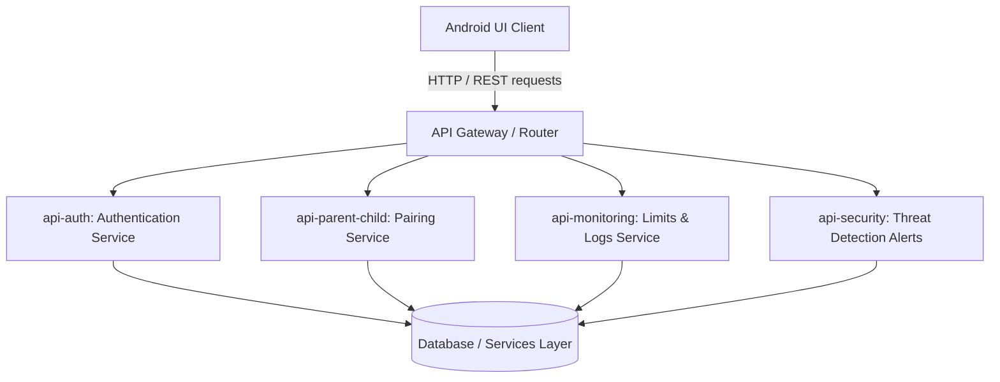

# Architecture Specification

This document details the high-level system architecture of the monorepo ecosystem, highlighting data flow and communication protocols between the Android Frontend UI client and the respective backend microservices.

## Intended Architecture Flow

---

## Component Layers

### 1. Android Frontend UI Client
* **Role**: Collects user interactions, logs events, monitors device integrity metrics, triggers vulnerability scanners, and provides interface panels for settings controls.
* **Communication Protocol**: Dispatches asynchronous HTTP/REST requests (JSON payloads) over TLS.

### 2. API Gateway / Communication Interface
* **Role**: Resolves local environment addresses (e.g., matching backend ports) and routes individual API payloads to the appropriate microservice.

### 3. Backend APIs (Modules)
* **Authentication (`api-auth`)**: Validates user credentials, processes JWT generation, handles password hashing, and verifies active sessions.
* **Parent-Child Linkage (`api-parent-child`)**: Registers pairing coordinates, connects active device link instances, and authorizes family hierarchy links.
* **Device Monitoring (`api-monitoring`)**: Synchronizes device statistics, monitors screen limit timers, records app blocking rules, and updates settings.
* **Vulnerability & Security Alerts (`api-security`)**: Manages malware definition libraries, performs scan verification, captures location-tracking changes, logs GPS spoof confidence stats, and processes security posture reports.

### 4. Database & External Services
* **Role**: Standardizes persistent schema storage and acts as the datastore for pairing status, transaction tables, user hashes, and threat feeds.
